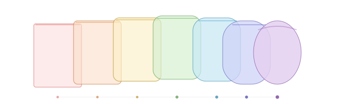

  

<h1 align="center">Gifio</h1>

A free, private GIF maker that runs entirely in your browser. No uploads, no servers, no accounts.

<strong><a href="https://dabirdwell.github.io/gifio/">→ Open Gifio</a></strong>

---

## What it does

Drop images in. Drag to reorder. Style them. Add atmosphere. Tune the timing. Download your GIF.

Your images never leave your computer. Everything runs locally in JavaScript.

## Features

**Core:**
- Drag-and-drop from Finder, Files, Desktop, anywhere
- Reorder frames by dragging thumbnails
- Live preview with play/pause and frame stepping
- Floyd-Steinberg dithering for better color quality
- Boomerang mode (forward + reverse)
- Adjustable speed, output size, and loop count
- Keyboard shortcuts (Space = play/pause, arrow keys = step)

**13 style presets (one-click looks):**
- Film noir · Silver gelatin · Sepia · Cyanotype · Faded Polaroid
- Golden hour · Midnight · Overcast · Candy
- Rainbow Glasses — each frame cycles through the spectrum
- Sunset Drift — warm to cool across frames
- Neon Pulse — alternating complementary hues
- Plus a Customize panel with brightness, contrast, saturation, warmth, vignette, and grain

**7 background elements:**
- Sunrise — gradient sky with rising sun and lens glow
- Moonrise — night sky with twinkling stars and crescent arc
- Rain — streaking droplets, unique per frame
- Snow — drifting particles with wind sway
- Sparkle — cross-shaped highlights that twinkle in and out
- Confetti — colorful shapes falling through
- Color Sweep — smooth gradient that shifts across frames
- Overlay or Behind compositing modes

**Timing intelligence:**
- Smooth loop — cross-fades the end into the beginning for seamless cycling
- Hold first / Hold last — pause on the opening or closing frame
- Smart timing — analyzes visual difference between frames and varies speed automatically. Moments with big changes get more time; similar frames move quickly. Creates natural rhythm from your content.
- Smart boomerang interaction (smooth loop defers when boomerang is on)

**Quietly smart:**
- Auto-suggests speed, size, and filename based on your images
- Detects B&W source images and suggests tonal presets
- Detects high-res photos and confirms dithering is on
- Suggests smooth loop for longer sequences and background elements for shorter ones
- Smart filenames with collision prevention — "Favorites - 1 of 7.JPG" downloads as `favorites.gif`, second export becomes `favorites-2.gif`

## Privacy

Everything runs in your browser via JavaScript. Your images are never uploaded anywhere. There is no server, no analytics, no tracking. View source to verify — it's one file.

## How to use

**Online:** Visit [dabirdwell.github.io/gifio](https://dabirdwell.github.io/gifio/)

**Locally:** Download `index.html` and double-click it. Opens in any browser.

**Self-host:** It's one file. Put it anywhere you serve HTML.

## How it works

The GIF encoder is written from scratch in vanilla JavaScript. Median cut color quantization, Floyd-Steinberg dithering, LZW compression, per-frame timing — all per the GIF89a spec. Style presets are canvas pixel operations applied nondestructively at export time. Background elements are procedural (drawn with JavaScript, no image assets). Smart timing analyzes pixel differences between adjacent frames to create natural rhythm.

One HTML file. 53 functions. Zero dependencies.

## Built by

[Humanity and AI](https://humanityandai.com) — Oklahoma City

Building tools that are delightfully light, genuinely useful, and respect the people who use them.

## License

MIT — do whatever you want with it.
